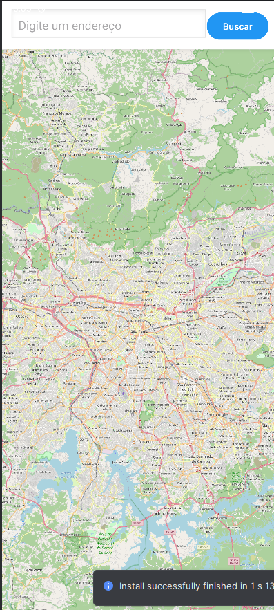
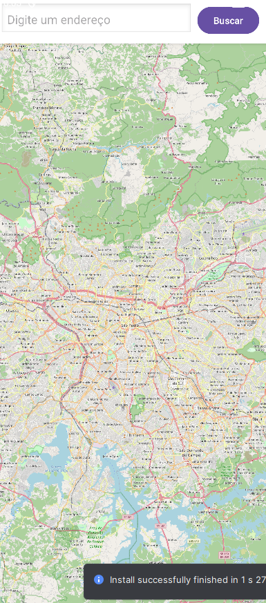

# 🎨 Tutorial: Melhorando a Interface do App de Mapas (Android + Kotlin)

---

## 📌 Objetivo

Neste tutorial, vamos melhorar a interface do aplicativo de mapas criado anteriormente, deixando-o mais moderno, organizado e agradável ao usuário.

---

## 🚀 O que será melhorado

- Layout mais organizado
- Campo de busca estilizado
- Botão mais moderno
- Melhor separação visual entre elementos
- Uso de cores e espaçamento

---

## 📸 Resultado esperado

📸 **Print sugerido:** Interface final estilizada  
Salvar como: `assets/ui1.png`



---

# 🧩 Passo 1 - Melhorando o layout

Abra o arquivo:

```

res/layout/activity_main.xml

````

Substitua por:

```xml
<LinearLayout xmlns:android="http://schemas.android.com/apk/res/android"
    xmlns:org.osmdroid="http://schemas.android.com/apk/res-auto"
    android:layout_width="match_parent"
    android:layout_height="match_parent"
    android:orientation="vertical"
    android:background="#F5F5F5">

    <!-- Container superior -->
    <LinearLayout
        android:layout_width="match_parent"
        android:layout_height="wrap_content"
        android:orientation="horizontal"
        android:padding="12dp"
        android:background="#FFFFFF"
        android:elevation="4dp">

        <EditText
            android:id="@+id/etEndereco"
            android:layout_width="0dp"
            android:layout_height="wrap_content"
            android:layout_weight="1"
            android:hint="Digite um endereço"
            android:background="@android:drawable/edit_text"
            android:padding="10dp"/>

        <Button
            android:id="@+id/btnBuscar"
            android:layout_width="wrap_content"
            android:layout_height="wrap_content"
            android:text="Buscar"
            android:layout_marginStart="8dp"/>
    </LinearLayout>

    <!-- Mapa -->
    <org.osmdroid.views.MapView
        android:id="@+id/map"
        android:layout_width="match_parent"
        android:layout_height="match_parent"/>

</LinearLayout>
````

---

## 💡 O que mudou?

* Usamos `LinearLayout` (mais moderno que RelativeLayout)
* Criamos um "top bar" com sombra
* Melhoramos espaçamento e alinhamento

📸 **Print sugerido:** Layout atualizado
Salvar como: `assets/ui2.png`



---

# 🎨 Passo 2 - Melhorando o botão

Você pode personalizar o botão com cores:

```xml
<Button
    android:id="@+id/btnBuscar"
    android:layout_width="wrap_content"
    android:layout_height="wrap_content"
    android:text="Buscar"
    android:backgroundTint="#2196F3"
    android:textColor="#FFFFFF"/>
```

---

# ✨ Passo 3 - Melhorando o campo de texto

```xml
<EditText
    android:id="@+id/etEndereco"
    android:layout_width="0dp"
    android:layout_height="wrap_content"
    android:layout_weight="1"
    android:hint="Digite um endereço"
    android:padding="12dp"
    android:background="@android:drawable/edit_text"/>
```

---

# 📌 Passo 4 - Pequenos ajustes importantes

Adicione espaçamento e organização:

* `padding` → melhora leitura
* `margin` → separa elementos
* `elevation` → cria efeito de sombra

---

# 🎯 Resultado

Agora o app possui:

* Interface mais limpa
* Melhor usabilidade
* Visual mais moderno

---

# 💡 Melhorias futuras

* 🔍 Ícone de busca
* 📍 Botão "Minha localização"
* 🧭 Barra de navegação
* 🌙 Modo escuro

---


```

