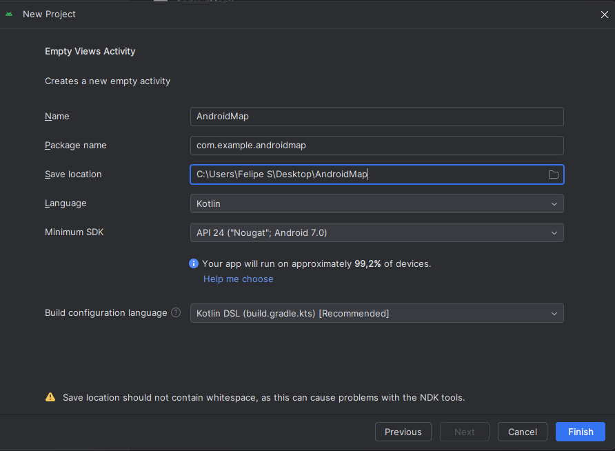
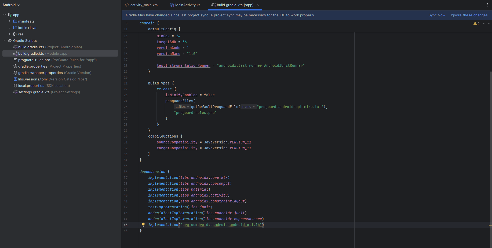
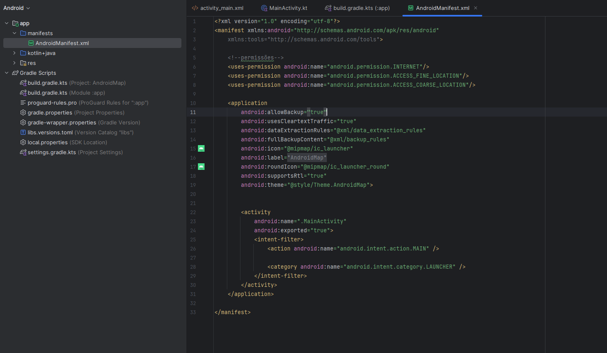
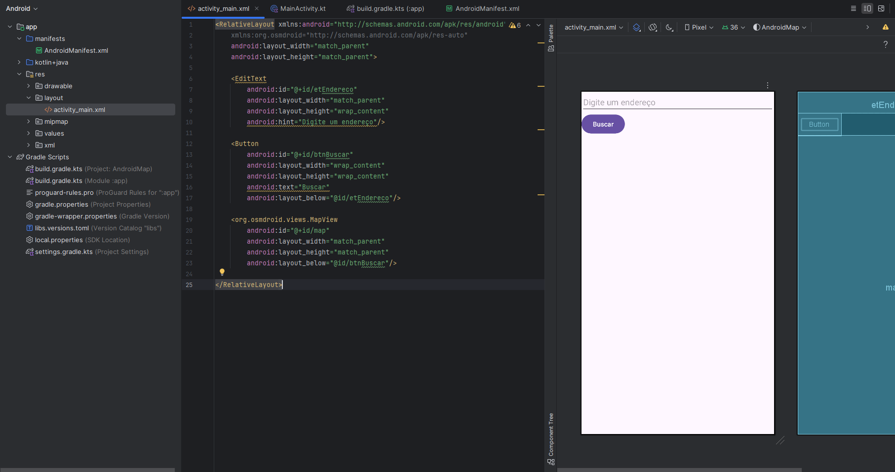
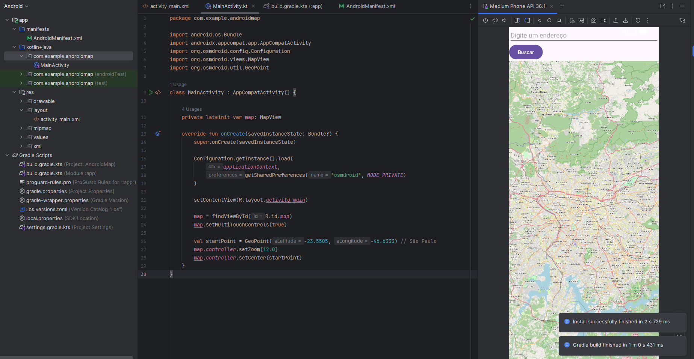
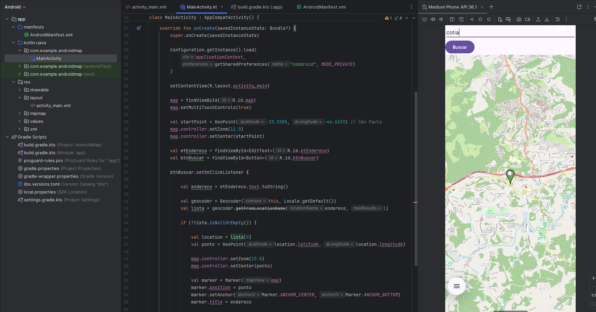
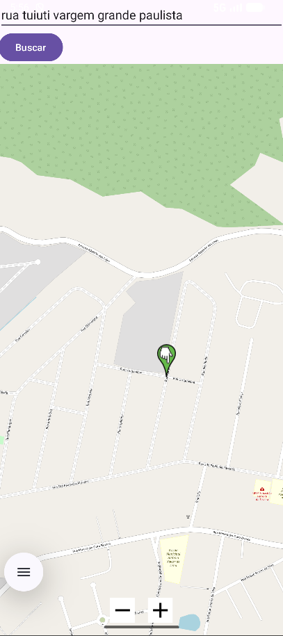

# 📱 Tutorial: Criando um App Android com Mapa usando OSMDroid (Kotlin)

---

## 📌 Objetivo

Este tutorial tem como objetivo ensinar, passo a passo, como criar um aplicativo Android utilizando **OpenStreetMap (OSMDroid)** com as seguintes funcionalidades:

- Exibir um mapa na tela
- Buscar um endereço digitado pelo usuário
- Centralizar o mapa no endereço buscado
- Adicionar um marcador no local encontrado

---

## 🛠️ Tecnologias Utilizadas

- Kotlin
- Android Studio
- OSMDroid (OpenStreetMap)
- Geocoder (API nativa do Android)

---

## 📁 Estrutura do Projeto

```

/docs
├── Tutorial.md
└── assets/
├── passo1.png
├── passo2.png
├── passo3.png
├── passo4.png
├── passo5.png
├── passo6.png
├── passo7.png

```

---

# 🚀 Passo a Passo

---

## 1. Criando o Projeto no Android Studio

1. Abra o Android Studio
2. Clique em **"New Project"**
3. Selecione **Empty Activity**
4. Configure:
   - **Nome:** MapaApp
   - **Linguagem:** Kotlin
   - **Minimum SDK:** API 24 ou superior

📸 **Print sugerido:** Tela de criação do projeto  
Salvar como: `assets/passo1.png`



---

## 2. Adicionando a dependência do OSMDroid

Abra o arquivo:

```

app/build.gradle

````

E adicione dentro de `dependencies`:

```gradle
implementation 'org.osmdroid:osmdroid-android:6.1.16'
````

Depois clique em **"Sync Now"**.

### 💡 Por que isso é necessário?

O OSMDroid é a biblioteca responsável por:

* Renderizar o mapa
* Buscar os tiles (imagens do mapa)
* Permitir interação com o mapa

📸 **Print sugerido:** Dependência adicionada
Salvar como: `assets/passo2.png`



---

## 3. Configurando permissões (AndroidManifest)

Abra o arquivo:

```
AndroidManifest.xml
```

### 3.1 Adicione as permissões fora da tag `<application>`:

```xml
<uses-permission android:name="android.permission.INTERNET"/>
<uses-permission android:name="android.permission.ACCESS_FINE_LOCATION"/>
<uses-permission android:name="android.permission.ACCESS_COARSE_LOCATION"/>
```

### 3.2 Dentro da tag `<application>`, adicione:

```xml
android:usesCleartextTraffic="true"
```

### 💡 Explicação

* **INTERNET** → necessário para carregar o mapa
* **FINE_LOCATION** → localização precisa (GPS)
* **COARSE_LOCATION** → localização aproximada (exigido pelo Android moderno)
* **usesCleartextTraffic** → permite conexões HTTP usadas pelo OSMDroid

📸 **Print sugerido:** Manifest configurado
Salvar como: `assets/passo3.png`



---

## 4. Criando o layout da interface

Abra o arquivo:

```
res/layout/activity_main.xml
```

Substitua o conteúdo por:

```xml
<RelativeLayout xmlns:android="http://schemas.android.com/apk/res/android"
    xmlns:org.osmdroid="http://schemas.android.com/apk/res-auto"
    android:layout_width="match_parent"
    android:layout_height="match_parent">

    <EditText
        android:id="@+id/etEndereco"
        android:layout_width="match_parent"
        android:layout_height="wrap_content"
        android:hint="Digite um endereço"/>

    <Button
        android:id="@+id/btnBuscar"
        android:layout_width="wrap_content"
        android:layout_height="wrap_content"
        android:text="Buscar"
        android:layout_below="@id/etEndereco"/>

    <org.osmdroid.views.MapView
        android:id="@+id/map"
        android:layout_width="match_parent"
        android:layout_height="match_parent"
        android:layout_below="@id/btnBuscar"/>

</RelativeLayout>
```

### 💡 Explicação

* `EditText` → campo para digitar endereço
* `Button` → aciona a busca
* `MapView` → componente do mapa

📸 **Print sugerido:** Layout no editor
Salvar como: `assets/passo4.png`



---

## 5. Configurando o mapa (MainActivity)

Abra:

```
MainActivity.kt
```

Adicione o seguinte código:

```kotlin
import android.os.Bundle
import androidx.appcompat.app.AppCompatActivity
import org.osmdroid.config.Configuration
import org.osmdroid.views.MapView
import org.osmdroid.util.GeoPoint

class MainActivity : AppCompatActivity() {

    private lateinit var map: MapView

    override fun onCreate(savedInstanceState: Bundle?) {
        super.onCreate(savedInstanceState)

        Configuration.getInstance().load(
            applicationContext,
            getSharedPreferences("osmdroid", MODE_PRIVATE)
        )

        setContentView(R.layout.activity_main)

        map = findViewById(R.id.map)
        map.setMultiTouchControls(true)

        val startPoint = GeoPoint(-23.5505, -46.6333) // São Paulo
        map.controller.setZoom(12.0)
        map.controller.setCenter(startPoint)
    }
}
```

📸 **Print sugerido:** App rodando com mapa
Salvar como: `assets/passo5.png`



---

## 6. Implementando busca de endereço

Adicione os imports:

```kotlin
import android.location.Geocoder
import android.widget.Button
import android.widget.EditText
import org.osmdroid.views.overlay.Marker
import java.util.Locale
```

Dentro do `onCreate`, adicione:

```kotlin
val etEndereco = findViewById<EditText>(R.id.etEndereco)
val btnBuscar = findViewById<Button>(R.id.btnBuscar)

btnBuscar.setOnClickListener {

    val endereco = etEndereco.text.toString()

    val geocoder = Geocoder(this, Locale.getDefault())
    val lista = geocoder.getFromLocationName(endereco, 1)

    if (!lista.isNullOrEmpty()) {

        val location = lista[0]
        val ponto = GeoPoint(location.latitude, location.longitude)

        map.controller.setZoom(15.0)
        map.controller.setCenter(ponto)

        val marker = Marker(map)
        marker.position = ponto
        marker.setAnchor(Marker.ANCHOR_CENTER, Marker.ANCHOR_BOTTOM)
        marker.title = endereco

        map.overlays.clear()
        map.overlays.add(marker)
        map.invalidate()
    }
}
```

### 💡 Explicação

* `Geocoder` → converte endereço em coordenadas
* `GeoPoint` → representa latitude/longitude
* `Marker` → adiciona um ponto no mapa

📸 **Print sugerido:** Busca funcionando
Salvar como: `assets/passo6.png`



---

## 7. Resultado Final

O aplicativo agora permite:

* Visualizar o mapa
* Buscar um endereço
* Centralizar o mapa
* Adicionar um marcador

📸 **Print sugerido:** Resultado final
Salvar como: `assets/passo7.png`



---

# ⚠️ Problemas comuns

* ❌ Mapa não carrega
  → Verifique a permissão de INTERNET

* ❌ Tela branca
  → Verifique `usesCleartextTraffic="true"`

* ❌ Erro de localização
  → Adicione `ACCESS_COARSE_LOCATION`

* ❌ App fecha ao buscar endereço
  → Verifique conexão com internet

---

# 🎯 Conclusão

Neste tutorial, você aprendeu a:

✔ Criar um app Android com Kotlin
✔ Integrar o OSMDroid
✔ Trabalhar com mapas
✔ Buscar endereços
✔ Adicionar marcadores

---

# 💡 Sugestões de melhorias

* Adicionar botão "Minha localização"
* Permitir múltiplos marcadores
* Salvar locais favoritos
* Integrar com backend

---

```

